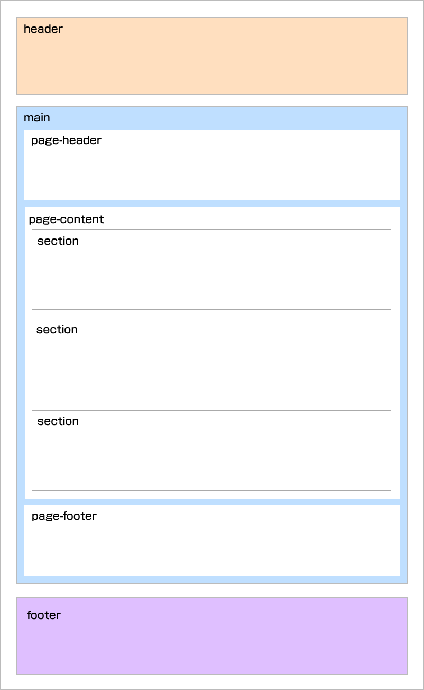
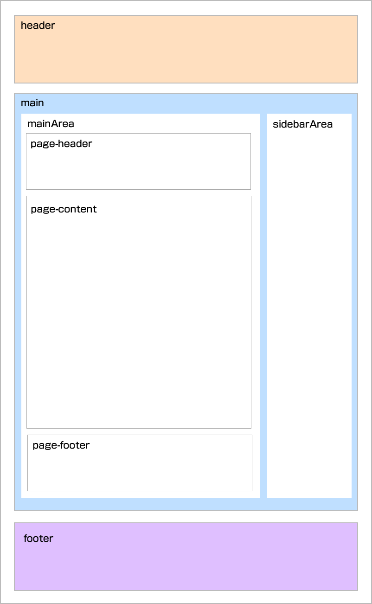

## 子要素をコンテナーからはみ出して画面いっぱいに広げるレイアウト
- sampleの一番下にて設定

## 1カラムレイアウトの幅

- layout-base: 896px
- layout-base-wide: 1024px
- layout-full: 1280px(containerのみ)

※ブロックで区切る場合は、sectionBlockを利用すること

## サイトの基本設定はtailwind.css
下記のファイルに記載する

- @import './styles/base.css';
- @import './styles/components.css';
- @import './styles/utilities.css';

## 機能

- build:eleventyでページ作成、assetsの移動
- serve:サーバーの起動
- css/sass:sassの処理
- css/autoprefixer:ベンダープリフェリックスの処理
- css/cssnano:CSSのminifi化
- css:css以下の処理を全て行う
- tailwind:assetsにtailwind.cssを生成 ※CSSのminifi化を行いたい

## typographyの使い方
- レイアウトの一部分に使う(ブログ、お知らせなど)
- 設定はtailwind.config.jsとdevelop.cssにて行う
- /code2/がレイアウトのサンプル

## PURGEの設定
- purgeを行う場合は、tailwind.config.jsのpurgeの設定を有効化する
- package-purge.jsonを参考にpackage.jsonを変更する。
`"tailwind": "cross-env NODE_ENV=production postcss _tailwind/tailwind.css -o assets/css/tailwind.css",`

## レイアウト構成

### １カラムの固定ページ

### 2カラムでサイドバーがあるページ
